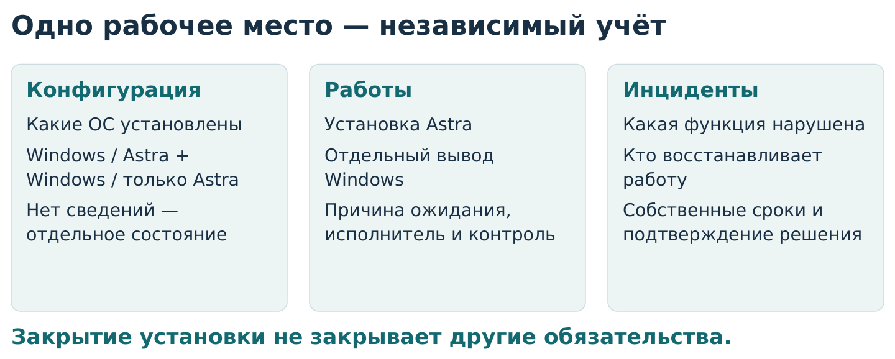

# Даниил Рогулин
## Сопровождение миграции рабочих мест на Astra Linux

**Кейс системного аналитика · банковская инфраструктура · существующий Service Desk**

[Кейс в PDF — 5 страниц](представление/Рогулин-Даниил-кейс-Astra-Linux.pdf) · [Краткая версия в браузере](представление/кейс.md) · [Профиль автора](https://github.com/branch-danya-dev)

**Задача:** описать учёт миграции и взаимодействие подразделений при удалённой и ручной установке операционной системы.

**Ключевая сложность:** установка Astra завершает миграцию по исходному критерию даже при сохранении Windows. Необходимо сохранить отдельный контроль полного перехода и нарушений работы.

**Выполненная работа:** разработаны модель объектов и состояний, требования к использованию Service Desk, правила передачи работ и отчётности, рабочие формы и проверяемые примеры.

**Статус:** проектное решение по заданным условиям. Банк обезличен; производственное внедрение и фактический эффект не заявлены. Все данные примеров вымышлены.

## Решение на одной схеме

**АРМ** — автоматизированное рабочее место; **ОС** — операционная система; **ПО** — программное обеспечение. **Service Desk** — условное название действующей системы регистрации и обработки обращений.



**Dualboot — двойная загрузка:** на компьютере сохранены Astra и Windows. Установка может быть завершена, а задача вывода Windows и инцидент — оставаться открытыми. Вывод Windows выполняется после применимой команды сопровождения ПО и подтверждается результатом работ.

Организация ресурсов остаётся у начальника и кураторов. Площадки сохраняют свои способы работы; унифицируются сведения для учёта и передачи задач, а не локальные процедуры.

## От риска к проверяемому правилу

На вымышленном АРМ `DEMO-ARM-004` Astra установлена, но два приложения удерживают Windows. Первое приложение готово к переходу, второе — нет.

| Шаг | Результат анализа |
|---|---|
| Риск | Закрытая установка скроет незавершённый полный переход |
| Решение | Отдельная задача вывода Windows и отдельный учёт каждой зависимости |
| Требования | ТР-08–ТР-11: сохранить обязательство, проверить зависимости, команду и результат |
| Проверка | Не разрешить планирование вывода Windows при неснятой зависимости |
| Результат примера | Установка завершена; Windows остаётся; следующий шаг — решение по второму приложению |

[Подробный разбор](представление/кейс.md#от-риска-к-проверяемому-правилу).

## Три документа для технического разбора

[Процесс работ](документы/03-процесс-работ.md) → [Модель учёта и состояния](документы/04-учёт-и-состояния.md) → [Требования с условиями проверки](документы/05-требования.md).

Результат подтверждается [демонстрационной сводкой](примеры/03-сводка.md), [разборами исключений](примеры/01-разборы-ситуаций.md) и [программой проверки](документы/10-проверка-правил.md). Это доказательство логики материалов, а не результатов внедрения.

<details>
<summary><strong>Полная документация и рабочие формы</strong></summary>

| Документ | Содержание |
|---|---|
| [01. Контекст и границы](документы/01-контекст-и-границы.md) | Исходные сведения и полномочия |
| [02. Участники](документы/02-участники-и-ответственность.md) | Ответственность и взаимодействие |
| [03. Процесс](документы/03-процесс-работ.md) | Основной путь и исключения |
| [04. Учёт](документы/04-учёт-и-состояния.md) | Объекты, связи и состояния |
| [05. Требования](документы/05-требования.md) | Правила и условия проверки |
| [06. Двойная загрузка](документы/06-двойная-загрузка.md) | Контроль последующего вывода Windows |
| [07. Инциденты](документы/07-инциденты-и-контроль.md) | Восстановление работы и контроль |
| [08. Показатели](документы/08-показатели.md) | Правила расчёта сводки |
| [09. Решения и риски](документы/09-решения-и-риски.md) | Альтернативы и согласования |
| [10. Проверка правил](документы/10-проверка-правил.md) | Положительные и отрицательные сценарии |
| [11. Обоснование и ограничения](документы/11-представление-кейса.md) | Аналитический вклад и границы доказательства |
| [12. Словарь](документы/12-словарь.md) | Термины и сокращения |

**Рабочие формы:** [карточка АРМ](шаблоны/01-карточка-арм.md), [передача работ](шаблоны/02-передача-работ.md), [вывод Windows](шаблоны/03-вывод-windows.md), [инцидент](шаблоны/04-инцидент.md), [сводка](шаблоны/05-сводка.md), [запрос решения](шаблоны/06-запрос-решения.md).

**Пример:** [исходные данные](примеры/02-данные.json) и [рассчитанная сводка](примеры/03-сводка.md).

</details>

<details>
<summary><strong>Проверка, обновление и подготовка к интервью</strong></summary>

Проверка исходного кейса не требует внешних библиотек. Python — язык программирования; нужна версия 3.10 или новее.

```bash
python проверки/проверить.py
```

[Как пересобрать PDF и схемы](представление/README.md) · [Проверка представления](проверки/проверить-представление.py) · [Отдельная памятка для собеседования](подготовка/собеседование.md).

Программа не подключается к банковским системам. В репозитории нет персональных данных сотрудников, настроек защиты, внутренних адресов или выгрузок Service Desk.

</details>
