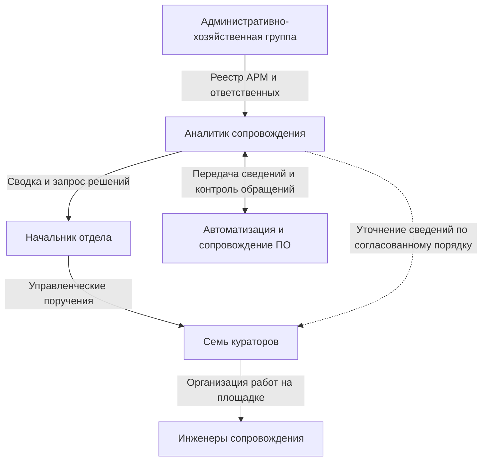

# 02. Участники и ответственность

[К содержанию](../README.md) · [Далее: процесс](03-процесс-работ.md)

## Управление и взаимодействие — разные связи

Начальник распределяет приоритеты и ресурсы через кураторов. Аналитик сопровождает информацию, задания и обращения. Положение аналитика между начальником и кураторами в описании структуры не даёт ему права линейного управления кураторами.

Пунктир означает обмен сведениями, а не подчинённость. **ПО — программное обеспечение**, то есть приложения и другие программы, необходимые для работы.

## Распределение ответственности

| Работа или решение | Основной участник | Участие аналитика |
|---|---|---|
| Предоставить сведения об АРМ, размещении и ответственных | Административно-хозяйственная группа | Найти расхождения, направить уточнение владельцу сведений |
| Предоставить сведения о ПО, ограничениях и согласованиях | Автоматизация и сопровождение ПО в своих направлениях | Связать ограничения с конкретными АРМ |
| Передать утверждённый список волны и его изменения | Уполномоченный владелец списка; фиксируется при получении | Сохранить источник, версию и историю изменений, не утверждать состав самому |
| Выполнить удалённую установку | Группа автоматизации | Контролировать получение результата и дальнейший шаг |
| Распределить ручные работы по ресурсам площадок | Начальник через кураторов | Подготовить перечень работ и сведения о рисках сроков |
| Организовать ручные работы внутри площадки | Куратор | Получить состояние исполнения без подмены локального управления |
| Выполнить ручную установку и зафиксировать результат | Инженер сопровождения | Проверить полноту записи и связанных обязательств |
| Подтвердить работоспособность и готовность ПО | Профильная группа сопровождения ПО | Получить применимое решение, не заменять его собственной оценкой |
| Выдать команду на вывод Windows | Группа сопровождения ПО | Связать команду с АРМ и зависимостями |
| Выполнить вывод Windows по разрешённому способу | Назначенная группа: автоматизация либо сопровождение | Контролировать выполнение; конкретный маршрут определяется утверждённой процедурой |
| Восстановить работу по инциденту | Назначенная профильная группа | Контролировать исполнителя, действие, срок и подтверждение результата |
| Изменить приоритеты и разрешить нехватку ресурсов | Начальник либо иной уполномоченный руководитель | Представить влияние, варианты и требуемое решение |
| Настроить поля, связи и отчёты Service Desk | Уполномоченный владелец системы | Описать потребность; использовать доступные средства до согласованной настройки |

Вводные не определяют технического исполнителя вывода Windows для каждого способа установки. Поэтому назначение «всегда инженер» или «всегда автоматизация» было бы необоснованным.

## Что остаётся разным на площадках

| Тип площадки | Особенность организации | Что необходимо для контроля |
|---|---|---|
| Малочисленная | Инженер может не находиться на месте постоянно | Согласованное время доступа и назначение работ |
| Удалённые АРМ | Пользователь подключается с другого устройства | Однозначный идентификатор мигрируемого АРМ и данные о влиянии на подключение |
| Закрытая | Ограничены доступы и каналы передачи сведений | Разрешённый объём сводки и доступная уполномоченным ссылка на подробности |
| Технические подразделения | Возможны специализированные рабочие средства | Перечень зависимостей от профильных групп, без самостоятельного признания совместимости |
| Руководители и VIP | Индивидуальный порядок организации работ | Согласованное время и контакт ответственного, без автоматического повышения всех инцидентов до максимального приоритета |

Общими предлагаются только сведения на границе подразделений: АРМ, работа, результат, текущий исполнитель, следующее действие, препятствие и контрольный срок. Эти требования утверждаются через начальника. Единая технология работы площадок не навязывается.

## Правило передачи ответственности

Запись «направлено в другую группу» не равна подтверждению начала работы. Аналитик видит назначенную группу и состояние принятия задания по действующему процессу. При отсутствии принятия он запрашивает следующий шаг и при необходимости обращается к начальнику.

Это правило контроля не заменяет установленный механизм назначения: если Service Desk передаёт ответственность при смене группы, используется именно этот механизм. Аналитик не создаёт параллельное распределение ответственности вне системы.
