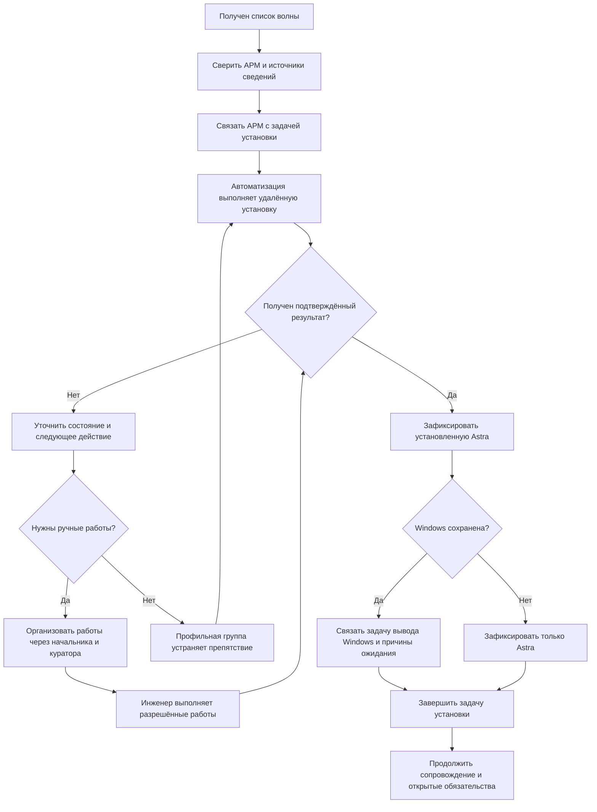

# 03. Процесс работ: от списка до сопровождения

[К содержанию](../README.md) · [Далее: учёт и состояния](04-учёт-и-состояния.md)

## Исходный процесс

По условиям задачи список АРМ поступает участникам миграции; автоматизация выполняет удалённую установку; при необходимости подключается инженер площадки. Установка Astra, в том числе вместе с Windows, засчитывается как завершённая миграция. Вывод Windows выполняется после команды сопровождения ПО.

Предлагаемое дополнение — сквозная связь записей и контроль следующего действия. Способ установки и полномочия подразделений не меняются.

## Схема основного пути

Это схема последовательности действий, а не формальная модель BPMN. **BPMN** — стандарт графического описания деловых процессов; здесь его специальные обозначения не используются.

Схема показывает типовой маршрут, но не заставляет сначала выполнять заведомо неприменимую удалённую попытку. Если уполномоченная группа сразу назначила ручную установку или двойную загрузку, сохраняется основание такого маршрута. При ожидании решения повторные попытки не запускаются автоматически.

## Шаги и результаты

| Шаг | Действие в зоне сопровождения | Что должно остаться в Service Desk |
|---|---|---|
| 1. Получить волну | Сверить идентификаторы, площадки, сроки и источники | Ссылка на исходный список, версия состава и перечень расхождений |
| 2. Связать работы | Найти существующие записи, не создать дубли | Одна запись участия АРМ в данной волне; связанные задачи |
| 3. Получить результат автоматизации | Отличить отправку задания от успешной установки | Результат попытки, момент события, источник, дальнейшее действие |
| 4. Передать ручные работы | Собрать необходимые сведения, вынести ресурсный вопрос начальнику | Причина передачи, назначение и условия доступа; [форма передачи](../шаблоны/02-передача-работ.md) |
| 5. Проконтролировать результат | Получить сведения инженера либо автоматизации | Подтверждение установки, фактическая конфигурация и связанные обращения |
| 6. Сохранить двойную загрузку в учёте | Зафиксировать причину сохранения Windows | Открытая задача вывода Windows и одна или несколько зависимостей |
| 7. Подготовить сводку | Отразить подтверждённые результаты и незавершённые действия | Срез на определённый момент с перечнем решений начальнику |

Если идентификатор АРМ неоднозначен, действие по переустановке не выводится из предположения аналитика. Запрашивается уточнение у источника данных; влияние на срок становится видимым. Аналитик не отменяет самостоятельно уже утверждённую волну.

## Установка не удалась

Сначала выясняется, что произошло. Отсутствие ответа, техническая ошибка и несовместимое оборудование — разные случаи.

При отсутствии ответа нельзя одновременно считать АРМ успешно установленным и безопасно запускать повторные работы. Автоматизация уточняет состояние текущего задания. Если требуется ручной способ, передача включает сведения о предыдущей попытке и допустимости следующего действия по утверждённой инструкции.

Если препятствие устранимо только заменой оборудования или решением по учётной записи, задача ожидает именно этого решения. Ручная установка не назначается как универсальное средство обхода любого ограничения.

## Во время работ нарушена функция пользователя

Создаётся или связывается инцидент по действующим правилам. **Инцидент** — нарушение или ухудшение нормальной работы сервиса. Работа по миграции и восстановление сервиса учитываются раздельно. Аналитик не предлагает собственный технический способ восстановления вне разрешённых процедур.

После восстановления через Windows инцидент может быть завершён по установленному процессу, но задача полного перехода остаётся. Если Astra больше не установлена, текущее состояние АРМ и отчёт корректируются; история первоначальной установки не удаляется.

## Как начинать при сжатых сроках

При первом получении данных выделяются четыре выборки: установка подтверждена; ещё выполняется; требуется ручная работа; дальнейший шаг не определён. Для каждой незавершённой записи определяются ответственный за следующее действие и контрольная точка.

Далее начальнику передаются только вопросы его уровня: нехватка исполнителей, конфликт сроков площадок, отсутствие решения смежной группы. Сверка данных не превращается в многодневную обязательную паузу для всех работ.

После очередного среза повторяется тот же цикл: получить изменения → проверить связи → уточнить неопределённые записи → проконтролировать действие → представить решения. Частоту срезов согласует начальник исходя из темпа волн.
