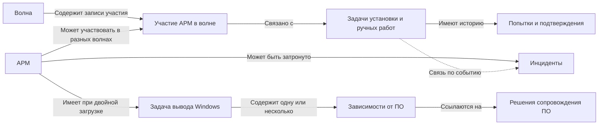

# 04. Учёт и состояния в Service Desk

[К содержанию](../README.md) · [Далее: требования](05-требования.md)

## Не новая система, а состав сведений

Ниже описана логическая модель: какие сведения существуют и как они связаны. Это не схема базы данных реального Service Desk. Сначала используются имеющиеся карточки, поля, связанные задания и отчёты. Недостающая возможность оформляется как согласуемое требование владельцу системы.

**Карточка** — запись об объекте или обращении. **Идентификатор** — значение, однозначно отличающее запись от остальных.

Линии показывают связи, но не требуют создания отдельного типа карточки для каждого блока. Например, зависимость может быть строкой структурированного описания связанной задачи.

## Объекты учёта

| Объект | Минимальные сведения | Основное правило |
|---|---|---|
| Волна | Идентификатор, источник, версия списка, плановый период, уполномоченный владелец изменений | Изменения состава сохраняются с основанием |
| АРМ | Устойчивый идентификатор, площадка, тип рабочего места, ссылка на владельца сведений, конфигурация, время и источник её подтверждения | Пользователь или сетевое имя сами по себе не всегда являются устойчивым идентификатором |
| Участие АРМ в волне | Ссылка на волну и АРМ, план, причина переноса или исключения | Пара «волна + АРМ» не дублируется |
| Задача установки | АРМ, волна, маршрут, состояние, группа, следующее действие, плановый срок, результат | История попыток не создаёт дополнительные мигрированные АРМ |
| Попытка или событие | Идентификатор события, время, источник, результат, ссылка на задачу | Повтор одного события не засчитывается второй раз |
| Задача вывода Windows | АРМ, причины сохранения, группа контроля, состояние, следующий контроль, команда и результат | Не закрывается вместе с задачей установки |
| Зависимость от ПО | Приложение или функция, профильная группа, связанное обращение, состояние готовности, применимое решение | У одного АРМ могут быть разные нерешённые зависимости |
| Инцидент | Нарушенная функция, затронутые АРМ, влияние, приоритет, группа, срок, история и подтверждение восстановления | Один инцидент может затрагивать несколько АРМ |

При замене компьютера связь старого и нового АРМ фиксируется по правилам владельца реестра. Нельзя молча подменить идентификатор внутри уже выполненной задачи.

## Три независимых измерения

### 1. Фактическая конфигурация

| Значение | Значение для отчёта |
|---|---|
| Windows | Наличие установленной Astra сейчас не подтверждено как факт конфигурации Windows; есть подтверждение именно Windows-конфигурации |
| Astra + Windows | Astra установлена, Windows остаётся; требуется контроль полного перехода |
| Только Astra | Astra установлена, вывод Windows подтверждён либо Windows не сохранялась |
| Не подтверждено | Нет достаточных актуальных сведений о конфигурации |

«Windows» не используется вместо «нет ответа». У подтверждённого состояния есть источник и время. Правило допустимой давности согласуется с владельцами данных; неизвестное число часов не задаётся в кейсе.

### 2. Выполнение установки

| Состояние | Что означает | Допустимый следующий шаг |
|---|---|---|
| Запланирована | Работа есть в плане, выполнение не начато | Удалённая установка, ручные работы либо ожидание |
| Удалённая установка | Автоматизация выполняет или уточняет текущую попытку | Завершение, ручные работы или ожидание решения |
| Ручные работы | Требуется работа инженера; назначение и время отражены отдельно | Завершение либо ожидание решения |
| Ожидание решения | Зафиксировано препятствие, исполнитель следующего действия и контроль | Возврат к нужному способу выполнения после решения |
| Завершена | Есть подтверждение установки Astra, в том числе вместе с Windows | Исторический результат сохраняется; новые работы создаются связанно |
| Прекращена | Есть решение уполномоченного участника о прекращении этой задачи | Не засчитывается как установка; основание и остаток обязательств видимы |

Перед закрытием установки проверяется подтверждение факта Astra. При двойной загрузке должна существовать задача вывода Windows; отсутствие учёта исправляется, но не превращает реально установленную Astra в «не установленную».

Если после завершения Astra удалена при восстановлении, исходная задача остаётся исторически выполненной. Текущая конфигурация меняется, а необходимые повторные работы оформляются связанно. В сводке различаются текущий результат и исторический факт установки.

### 3. Состояние вывода Windows

| Состояние | Условие |
|---|---|
| Ожидание готовности ПО | Не все зависимости сняты применимыми решениями |
| Готово к организации работ | Получена применимая команда сопровождения ПО, все относящиеся к ней условия выполнены |
| Запланировано | Определены исполнитель и согласованное время работ |
| Выполняется | Назначенный исполнитель начал утверждённую процедуру |
| Ожидание устранения препятствия | Возникло новое препятствие; есть следующее действие и контроль |
| Завершено | Подтверждено состояние «только Astra», сохранены результат и источник |

Применимая команда — решение, область действия которого включает конкретный АРМ и нужные зависимости. Сообщение «программа готова» без ясной области действия требует уточнения.

Инциденты сохраняют действующие состояния Service Desk; новый параллельный жизненный цикл инцидента не вводится.

## Время и история

Для события различаются **момент выполнения** и **момент внесения записи**. Если результат пришёл позже среза отчёта, он включается в следующий срез либо в явно обозначенную исправленную версию, но не незаметно меняет ранее переданную сводку.

При противоречивых источниках аналитик не выбирает удобный ответ. Он фиксирует расхождение и запрашивает подтверждение у владельцев. На время уточнения состояние отмечается как неподтверждённое, с сохранением последнего известного значения в истории.

## Доступ к сведениям

Подробности закрытой площадки хранятся только в разрешённой системе и доступны уполномоченным лицам. В общей сводке используются допустимые агрегированные значения и разрешённые ссылки. Сам факт нахождения ссылки в карточке не даёт получателю права читать закрытые данные.

[Шаблон карточки АРМ](../шаблоны/01-карточка-арм.md) показывает заполнение без раскрытия внутренних технических параметров.
