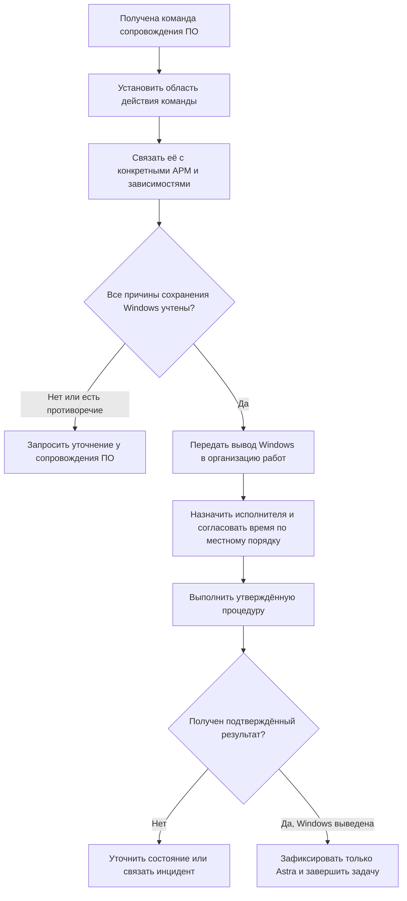

# 06. Двойная загрузка и последующий вывод Windows

[К содержанию](../README.md) · [Далее: инциденты](07-инциденты-и-контроль.md)

**Dualboot, или двойная загрузка**, — наличие на одном компьютере двух операционных систем с возможностью выбора при запуске. По условиям кейса это допустимый промежуточный результат: Astra установлена, а Windows сохраняет доступ к необходимому программному обеспечению.

Наличие двух систем не означает, что пользователь уже выполняет всю работу в Astra. Поэтому факт установки и остаток Windows показываются раздельно.

## Что фиксируется при установке

В момент подтверждения двойной загрузки задача установки завершается по принятому критерию. Одновременно связывается задача вывода Windows. В ней указываются АРМ, конкретные причины сохранения Windows, профильные группы и связанные обращения, следующее контрольное действие.

Если причина ещё не предоставлена, это не основание отрицать уже выполненную установку. Создаётся задача уточнения причины, состояние вывода Windows остаётся ожидающим. Неизвестное приложение нельзя заменить отметкой «всё готово».

Аналитик контролирует наличие обязательства. Это не означает, что он становится техническим исполнителем исправления ПО: у профильной группы остаётся собственная задача по зависимости.

## Пример нескольких зависимостей

На вымышленном АРМ `DEMO-ARM-004` Windows сохранена для «Приложения А» и «Приложения Б».

| Зависимость | Что известно | Можно ли считать её снятой? |
|---|---|---|
| Приложение А | Есть решение сопровождения ПО, применимое к данному АРМ | Да, в пределах условий решения |
| Приложение Б | Исправление ещё не подтверждено | Нет |

Вывод Windows не переходит к выполнению только потому, что одна строка готова. Аналитик запрашивает решение по оставшейся зависимости. Он не проводит вместо сопровождения ПО собственные испытания и не объявляет Приложение Б совместимым.

## Порядок после команды сопровождения ПО

Сопровождение ПО может выдать одну общую команду, снимающую несколько зависимостей. Не требуется искусственно получать отдельное письмо на каждую строку: достаточно явной применимости решения ко всем причинам. Если команда противоречит известной незакрытой зависимости, аналитик уточняет её содержание, а не самостоятельно отменяет решение профильной группы.

Команда должна быть прослеживаема: автор или ответственная группа, время, область действия, условия и ссылка на разрешённую запись. Точное название документа и канал задаёт действующий порядок банка.

## При возникновении препятствия

Если работы нельзя провести в согласованное время, задача остаётся открытой с причиной и следующим контролем. Организационный перенос не отменяет технической готовности ПО.

Если сопровождение ПО отозвало готовность либо обнаружена новая зависимость, аналитик связывает новое решение и уточняет допустимость продолжения. Он не скрывает прежнее основание и не объявляет Windows выведенной задним числом.

При нарушении работы пользователя связывается инцидент. Решение о техническом восстановлении принимает и выполняет уполномоченная группа по действующей процедуре.

## Подтверждение завершения

Для завершения задачи нужен результат исполнителя или другой согласованный источник, подтверждающий состояние «только Astra». В записи сохраняются время, результат и основание работ. Команда сопровождения ПО и выполненные работы — разные события.

Технические действия по разделам диска, загрузчику, данным и удалению ОС в этом кейсе не описываются. Их выполняют только по утверждённой инструкции с предусмотренными ею мерами сохранности данных. Аналитик не придумывает способ удаления Windows.

Если АРМ выведено из состава проекта или эксплуатации, применяется отдельное решение уполномоченного владельца. Прекращение обязательства по такому основанию не выдаётся за успешный вывод Windows или полный переход на Astra.

[Рабочая форма задачи вывода Windows](../шаблоны/03-вывод-windows.md).
