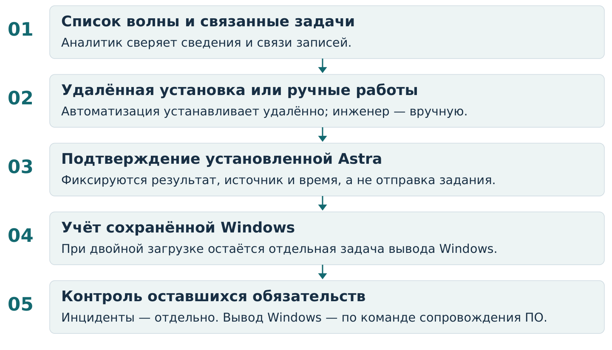

<!-- Создано программой собрать.py; содержимое задаётся в функции pages. -->

# Сопровождение миграции на Astra Linux

Даниил Рогулин · Кейс системного аналитика

> Проектное решение по заданным условиям. Банк и площадки обезличены; производственное внедрение и фактический эффект не заявлены.

## Задача и исходные условия

Организовать учёт работ и взаимодействие подразделений при переходе рабочих мест с Windows на Astra Linux. Первые списки уже выданы, сроки сжаты, площадки различаются по пользователям и ограничениям.

**Контур задачи:** головные офисы Москвы, включая удалённые рабочие места в этих офисах. Заданный диапазон — от 1 до 10 000 АРМ; это граница масштаба, а не выполненный объём.

## Главная неоднозначность

По исходному критерию установка Astra завершает миграцию даже при сохранении Windows. Такой результат нельзя приравнять ни к полному переходу, ни к отсутствию нарушений работы.

## Выполненная аналитическая работа

| Что разработано | Для чего |
|---|---|
| Модель объектов и состояний | Разделить конфигурацию, работы и инциденты. |
| Требования и условия проверки | Сделать передачу работ и завершение задач однозначными. |
| Правила отчётности и примеры | Показывать установленную Astra отдельно от остатка Windows. |

**Роль в решении:** анализ учёта, контроль исполнения и связь подразделений. Ресурсами семи кураторов управляет начальник; архитектуру и совместимость определяют профильные команды.

**Термины:** АРМ — автоматизированное рабочее место; ОС — операционная система; ПО — программное обеспечение. Service Desk — условное название существующей системы учёта и обработки обращений.

---

## Процесс и ответственность

Общий учёт — без одинакового способа работы для всех площадок

Схема последовательности действий. Специальная система обозначений не используется.

**Ручные работы:** инженеру передаются причина, сведения о предыдущей попытке и требуемое действие. Организация ресурсов проходит через начальника и куратора; согласованный ручной маршрут возможен сразу.

**Нет результата:** автоматизация уточняет состояние текущей попытки. Отсутствие ответа не служит основанием ни для закрытия установки, ни для автоматического повтора операции.

**Нарушена работа:** регистрируется связанный инцидент по действующим правилам. Передача обращения другой группе не означает восстановления сервиса.

Площадки сохраняют свои способы выполнения работ. Для закрытого контура в общую сводку попадают только разрешённые сведения; при удалённой работе учитывается целевое АРМ, а не устройство подключения.

[Полный процесс](../документы/03-процесс-работ.md) · [Участники и ответственность](../документы/02-участники-и-ответственность.md)

---

## Модель учёта

Установка завершена — другие задачи могут оставаться открытыми

Связи реализуются штатными средствами Service Desk. Новая информационная система не предлагается.

## Что меняется в учёте

| Объект | Правило |
|---|---|
| Участие АРМ в волне | Пара «волна + АРМ» уникальна. Повторная попытка не увеличивает число мигрированных мест. |
| Фактическая конфигурация | Есть источник и время подтверждения. Неизвестное состояние не записывается как Windows. |
| Задача вывода Windows | Связана с АРМ, причинами сохранения Windows, решением сопровождения ПО и результатом работ. |
| Инцидент | Имеет собственные сроки и подтверждение восстановления. Может затрагивать несколько АРМ. |

## Почему не одна задача со статусом «Готово»

Один общий статус смешивает разные факты: ОС установлена, Windows сохранена, рабочая функция нарушена. Раздельный учёт позволяет завершить установку по исходному критерию и сохранить контроль оставшихся обязательств.

**Dualboot — двойная загрузка:** на компьютере сохранены обе операционные системы. Полный переход подтверждается состоянием «только Astra», а не фактом выдачи команды.

[Объекты и состояния](../документы/04-учёт-и-состояния.md) · [Контроль двойной загрузки](../документы/06-двойная-загрузка.md)

---

## От риска к проверяемому правилу

Вымышленный пример DEMO-ARM-004: две зависимости от ПО

**Исходная ситуация:** Astra и Windows установлены вместе. Приложение А готово к работе в новой среде, по Приложению Б готовность не подтверждена. Задача установки завершена.

| Шаг анализа | Решение в кейсе |
|---|---|
| Риск | Закрытая установка скроет незавершённый переход; готовность одного приложения ошибочно примут за готовность всего АРМ. |
| Выбор | Отдельная задача вывода Windows и отдельный учёт каждой зависимости. |
| Почему не общий признак | Поле «ПО готово» не показывает, какая именно функция ещё требует Windows. |
| Проверка | Попытка запланировать вывод Windows при неснятой зависимости должна быть отклонена проверкой примера. |

## Связь с требованиями

| Код | Проверяемое правило |
|---|---|
| ТР-08 | Задача вывода Windows остаётся открытой после завершения установки. |
| ТР-09 | У одного АРМ может быть несколько независимых причин сохранения Windows. |
| ТР-10 | Команда сопровождения ПО применима к этому АРМ и нужным зависимостям. |
| ТР-11 | Завершение подтверждается результатом работ, а не командой. |

> Результат для DEMO-ARM-004: установка завершена; конфигурация — Astra + Windows; задача DEMO-WIN-004 ожидает готовности ПО. Следующее действие — получить решение по Приложению Б.

Отдельно проверяются отсутствие команды, команда для другого АРМ и преждевременное закрытие вывода Windows. Это проверки логики примера, а не испытания банковской системы.

[Все требования](../документы/05-требования.md) · [Разборы ситуаций](../примеры/01-разборы-ситуаций.md) · [Программа проверки](../документы/10-проверка-правил.md)

---

## Результат подготовки и проверка

Подготовленное решение, не заявленный эффект внедрения

Результат — согласованная между документами модель процесса, объектов, состояний и требований. Рабочие формы показывают, какие сведения нужны участникам; программа сверяет пример и расчёт сводки.

## Демонстрационная сводка

Срез вымышленной волны: 08.10.2026, 12:00 (часовой пояс +03:00). Это не данные банка.

| Показатель | Значение |
|---|---|
| АРМ в волне | 12 |
| Только Astra | 4 |
| Astra + Windows | 3 |
| Только Windows | 4 |
| Конфигурация не подтверждена | 1 |
| Astra установлена сейчас | 7 из 12 — 58,3% |
| Исторически установка подтверждалась | 8 |
| Открытые инциденты | 1 |

Историческая установка не подменяет текущую конфигурацию: в примере одно АРМ вернулось к Windows. Инциденты считаются отдельно и не складываются с количеством установленных ОС.

## Как проверено

Проверка исходного кейса сверяет ссылки, данные и сводку, а также выполняет 17 положительных и отрицательных проверок примера. Проверка представления дополнительно сверяет показатели PDF с исходными данными, ссылки, число страниц и целостность файлов.

## Границы доказательства

Подтверждена логика подготовленных материалов. Не заявлены настройка реального Service Desk, проверка совместимости Astra, миграция 10 000 АРМ или измеренное сокращение простоев. Производственное применение требует согласований владельцев процессов.

[Репозиторий и автор](../README.md) · [Исходные данные](../примеры/02-данные.json) · [Полная сводка](../примеры/03-сводка.md) · [Обоснование и ограничения](../документы/11-представление-кейса.md)
